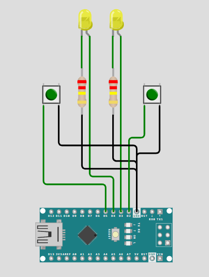

---
const int led1 = 3;
const int led2 = 4;

const int button1 = 2;
const int button2 = 5;

bool led1State = false;
bool led2State = false;

bool lastButton1 = HIGH;
bool lastButton2 = HIGH;

void setup() {
  pinMode(led1, OUTPUT);
  pinMode(led2, OUTPUT);

  pinMode(button1, INPUT_PULLUP);
  pinMode(button2, INPUT_PULLUP);
}

void loop() {
  bool currentButton1 = digitalRead(button1);
  bool currentButton2 = digitalRead(button2);

  // --- Toggle LED 1 ---
  if (lastButton1 == HIGH && currentButton1 == LOW) {
    led1State = !led1State;          // wissel aan/uit
    digitalWrite(led1, led1State);
    delay(200);                      // simpele debounce
  }
  lastButton1 = currentButton1;

  // --- Toggle LED 2 ---
  if (lastButton2 == HIGH && currentButton2 == LOW) {
    led2State = !led2State;
    digitalWrite(led2, led2State);
    delay(200);
  }
  lastButton2 = currentButton2;
}
