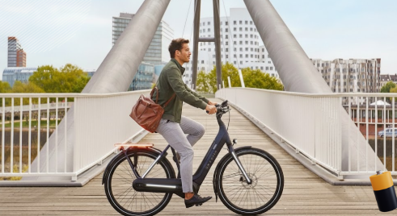

# BrakeNBlink
Brake N Blink is een (semi) automatisch rem en richtingaanwijzersysteem voor fietsen dat
de zichtbaarheid en veiligheid van fietsers verhoogt. Het detecteert automatisch via een IMU/Knoppen of de fietser remt/gaat afslaan en stuurt zo de remlichten en richtingaanwijzers aan.

---

## Doel van het project
Fietsers behoren tot kwetsbare weggebuikers, vooral in steden of omgevingen met een beperkte zichtbaarheid. Brake N Blink verhoogt de zichtbaarheid (zeker s'nachts) van de fietser voor andere weggebruikers.

---
## Product

### Vooraan
Drukknoppen voor de linker- en rechterrichtingaanwijzer, verbonden via Bluetooth met de achterste controlemodule. Eigen batterijvoorziening.

### Achteraan
Achteraan zit een microcontroller die het remlicht aanstuurt op basis van de interne IMU. De richtingaanwijzers worden bediend via een stuurmodule die draadloos verbonden is via Bluetooth.

### Uitbreiding
Led strips in de spaken via een microcontroller met interne batterij. Specifiek hebben we twee LED-strips tegenover elkaar gemonteerd op het voorwiel van de fiets. Deze strips produceren verschillende lichtpatronen, aangestuurd door een microcontroller, om de zichtbaarheid en esthetiek van de fiets te verbeteren.

---
## Project Management

Wij maken gebruik van Trello voor de sprintplanning en issue tracking.

---

## Reflectie

Tijdens dit project hebben we veel geleerd over het ontwerpen en implementeren van een elektronisch systeem voor fietsen. We hebben ervaring opgedaan met het gebruik van microcontrollers, Bluetooth-communicatie en het integreren van verschillende componenten zoals LED-strips en drukknoppen. We hebben ook geleerd hoe we een project kunnen structureren en documenteren, wat belangrijk is voor samenwerking en toekomstige referentie.

Hoewel we enkele uitdagingen tegenkwamen, zoals het optimaliseren van de Bluetooth-verbinding en het ontwerpen van een sterke en functionele behuizing. We hebben deze problemen opgelost door middel van trial and error. Al met al heeft dit project ons waardevolle vaardigheden en inzichten opgeleverd die we in toekomstige projecten kunnen toepassen.

---

## Repository structuur

- 📁 **[3D model behuizing/](3D%20model%20behuizing/)**: Bevat 3D-modellen voor de behuizing van het systeem, inclusief Blender-bestanden en 3MF-bestanden voor 3D-printing.
- 📁 **[Documentatie/](Documentatie/)**: Omvat alle documentatie gerelateerd aan het project.
  - 📁 **[Datasheets & Materiaal lijst/](Documentatie/Datasheets%20%26%20Materiaal%20lijst/)**: Datasheets, materiaaloverzichten en informatie over componenten zoals batterijhouders, bedrading, drukknoppen, LED-strips, microcontroller (Arduino), printplaten en batterijen.
  - 📁 **[Gids/](Documentatie/Gids/)**: Handleidingen, zoals de GitHub-gids.
  - 📁 **[Knoppen/](Documentatie/Knoppen/)**: Documentatie over de drukknoppen.
  - 📁 **[Overzichten/](Documentatie/Overzichten/)**: Overzichten van materialen, inclusief specifieke informatie over drukknoppen.
  - 📁 **[Voorstellingen/](Documentatie/Voorstellingen/)**: Sprekersnotities voor presentaties.
- 📁 **[Poster/](Poster/)**: Bevat de projectposter.
- 📁 **[Prototypes and simulations/](Prototypes%20and%20simulations/)**: Code en schema's voor prototypes en simulaties.
  - 📁 **[Eerste versie op breadboard/](Prototypes%20and%20simulations/Eerste%20versie%20op%20breadboard/)**: Eerste prototype op breadboard met Arduino-code.
  - 📁 **[Eindresultaat/](Prototypes%20and%20simulations/Eindresultaat/)**: Finale prototypes, inclusief LED-strips en normale LEDs met Bluetooth-functionaliteit.
  - 📁 **[Led strip Test/](Prototypes%20and%20simulations/Led%20strip%20Test/)**: Testcode voor LED-strips.
  - 📁 **[Prototype Gyro/](Prototypes%20and%20simulations/Prototype%20Gyro/)**: Prototype met gyroscoop.
  - 📁 **[Prototype Remlicht/](Prototypes%20and%20simulations/Prototype%20Remlicht/)**: Prototype voor remlicht.
  - 📁 **[Top Down Schema's/](Prototypes%20and%20simulations/Top%20Down%20Schema%27s/)**: Top-down schema's voor prototypes, master, slave en uitbreidingen.
  - 📁 **[Uitbreiding/](Prototypes%20and%20simulations/Uitbreiding/)**: Uitbreidingen voor het systeem, inclusief extra LEDs.
- 📁 **[Sociale media/](Sociale%20media/)**: Afbeeldingen en media voor sociale media, inclusief 3D-printing, prototypes op de fiets en solderen.

## Team
dit project is gemaakt door:

- **Tom Pladijs** - fase 2, Elektronica
- **Timo Sinnaeve** - fase 1, Elektronica ICT
- **Aaron Lestarquit** - fase 1, Elektronica ICT

